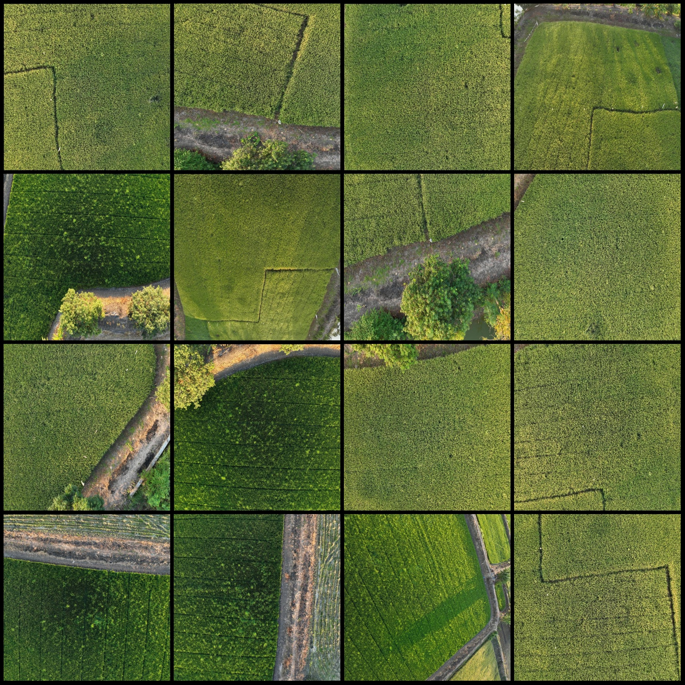
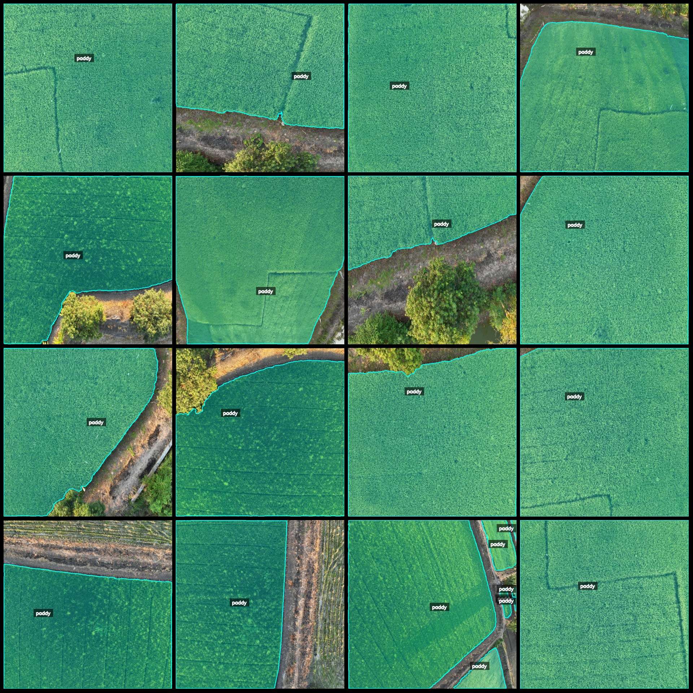
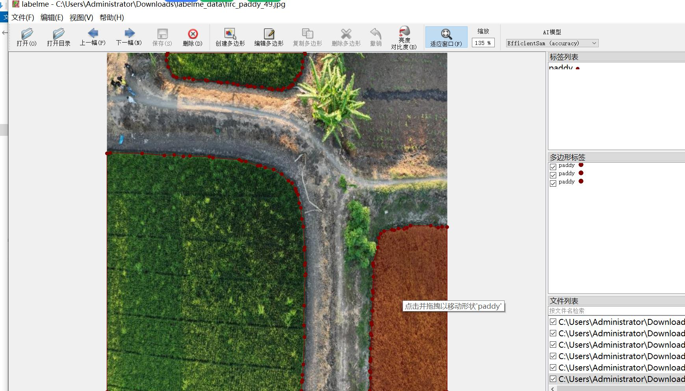

# UAV Perspective Rice Field Identification and Segmentation Dataset in Labelme Format with 869 Images and 1 Category

Dataset format: Labelme format (without mask files, only containing JPG images and corresponding JSON files)
Number of images (number of JPG files): 869
Number of annotations (number of JSON files): 869
Number of annotation categories: 1
Annotation category name: "paddy"
Number of boxes for each category: 1138
Total boxes: 1138
Using labelme tool: labelme version 5.5.0
Image resolution: 640x640
Annotation rules: Polygons are drawn around the categories
Important Notice: The dataset can be edited using labelme, but the JSON dataset needs to be converted into either Mask or Yolo or COCO format for semantic segmentation or instance segmentation.
Special Remarks: This dataset does not guarantee the accuracy of the trained models or weight files.
Image previews:
Annotation examples:
Randomly selected 16 images:
Annotation drawing results:
Labelme editing example image:

## Images

Here is a pay link on Stripe ( https://buy.stripe.com/3cs8yP7sY87d0vu9AB ). Please contact me lonlonago@foxmail.com after funding $89, and I will send you a complete data files , thank you!

